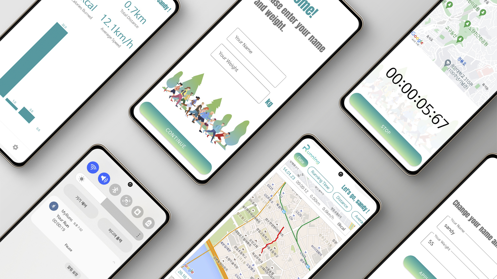

# Project_MyRuns
한강 산책을 좋아하는 **나**를 위해 만든 앱  

 
 
## Skills
   
+ AAC(Android Architecture Component) : Lifecycles, LiveData, ViewModel, Room, Navigation
+ Dagger-Hilt
+ Coroutine
+ Foreground Service
+ Google Maps SDK
+ FusedLocaionProvider
+ Timber
+ Easy Permissions
+ Glide
+ MPAndroidChart

 

## Link

APK 파일 다운로드 : [링크](https://drive.google.com/file/d/1SVSnODR2khHtiJ8cjyl-jGLmggX1NKvq/view?usp=sharing)  
